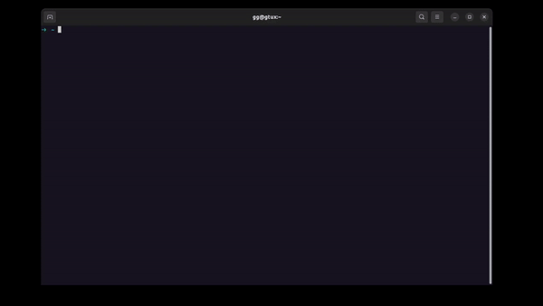

# gon-cli

The GON cli is a CLI for Game of NFTs. It can create classes/collections/denoms, mint NFTs, transfer NFTs, and query NFTs from a single CLI.

## Feature matrix

| Chain    | Create Class | Mint NFTs | Transfer NFTs (over IBC) | Query NFTs |
|----------|--------------|-----------|--------------------------|------------|
| IRIS     | ✅            | ✅         | ✅                        | ✅          |
| Stargaze | ❌            | ❌         | ✅                        | ✅          |
| Juno     | ❌            | ❌         | ✅                        | ✅          |
| Uptick   | ❌            | ❌         | ✅                        | ✅          |
| OmniFlix | ❌            | ❌         | ✅                        | ✅          |

Extra helper tools and features:
- ✅ IBC Transaction lookup
- ✅ Key management
- ✅ Multiline editor for NFT metadata
- ✅ List GoN IBC Connections
- ✅ Calculate Class Hash
- ✅ Generate Class IBC trace (by choosing each hop)
- ✅ Generate relay commands so that you can relay yourself with `rly` or `hermes` on the paths you need only

## Usage

Simply run `gon` and follow the instructions:



### Editor
The editor, which is used for multiline fields, might default to `vim` in many peoples environment. You can override this by setting the `EDITOR` environment variable (to for instance nano), or simply set it when calling the cli like this:
```bash
$ EDITOR=nano gon
```

### Key management
To manage keys directly, you can use the familiar `gon keys [command]` commands like `gon keys add --recover`, `gon keys list`, etc.

## Installation

### Download binary

[Download](https://github.com/gjermundgaraba/gon-tools/releases/latest/download/gon) the latest release and use it directly.

### Install from source

```bash
$ go install
```
